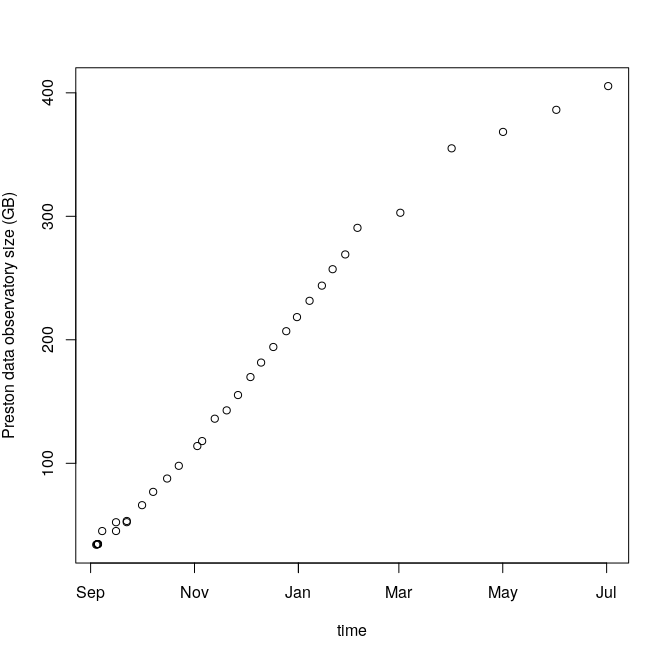

# Preston Analysis

Preston records how and when datasets are discovered and accessed in the rdf/nquads. These crawl records, or biodiversity dataset graphs, can be loaded into triple stores like [Apache Jena Fuseki](https://jena.apache.org/documentation/fuseki2/) for discovery and analysis. 

This page contains some [sparql](https://www.w3.org/TR/rdf-sparql-query/) queries to discover and analyze the dataset graph. 

# Use Cases

 * [`Detecting Linkrot`](#detecting-linkrot)
 * [`Content Drift`](#content-drift)
 * [`Large-scale Content Analysis`](#large-scale-content-analysis)
 * [`Large-scale Content Analysis Continued`](#large-scale-content-analysis-continued)
 * [`Linkrot and Content Drift Revisited`](#linkrot-and-content-drift-revisited)

## Detecting Linkrot

[Linkrot](https://en.wikipedia.org/wiki/Link_rot), a well documented, and often occurring, phenomenon in which content associated to links become permanently unavailable.  

URLs are used to access content. While the URLs might be static, the content is often not. High turnover or error rates in content linked to by a url can be a sign of an instable, actively maintained, or randomly changing datasets. Since Preston is continuously tracking urls and their content, we can use its output, a biodiversity dataset graph, to detect linkrot (and content drift). 

### Reproduce 
If you'd like to reproduce the results below, please:

1. download (https://jena.apache.org/download/) and install Apache Jena Fuseki
2. start Jena Fuseki (./fuseki-server). If it runs well, you will see the administration console at http://localhost:3030
3. download the data file https://zenodo.org/record/1472394/files/preston-ls.nq.bz2
4. using the Fuseki administration console, create a new dataset and add the data file as an in-memory resource. If this procedure fails, try decompressing the bz2 file and add its uncompressed version instead.
5. copy the query (find below) in the SPARQL query section, leave the by-default options, and click on the arrow at the upper right to execute the query. The results should appear at the bottom.


### Change Rate of Urls

To detect the rate of change of urls the following query was created. This query generates a list of urls in decreasing order of change rate. Note that Preston records each failed attempt to access a url's content as "blank" content. 

```sparql
SELECT DISTINCT ?url (COUNT(?url) as ?totalVersions)
WHERE {
  { ?url <http://purl.org/pav/hasVersion> ?firstVersion }
  { ?aVersion (<http://purl.org/pav/previousVersion>|^<http://purl.org/pav/previousVersion>)* ?firstVersion }
  { ?aVersion <http://www.w3.org/ns/prov#generatedAtTime> ?generationTime }
} GROUP BY ?url ORDER BY DESC(?totalVersions)
LIMIT 10
```

Using Poelen, Jorrit H. (2018). A biodiversity dataset graph (Version 0.0.1) [Data set]. Zenodo. http://doi.org/10.5281/zenodo.1472394 , this created the following results:

url |	totalVersions
--- | ---
http://bim-mirror.aseanbiodiversity.org:8080/ipt/archive.do?r=flora_of_agusanmarsh | 140
http://bim-mirror.aseanbiodiversity.org:8080/ipt/archive.do?r=iccemclsu-rsa_pantabangan_fauna | 140
http://bim-mirror.aseanbiodiversity.org:8080/ipt/archive.do?r=rgonzalez_museum |	140
http://bim-mirror.aseanbiodiversity.org:8080/ipt/eml.do?r=camiguin_fauna |	140
http://bim-mirror.aseanbiodiversity.org:8080/ipt/eml.do?r=fauna_for_borneo |	140
http://bim-mirror.aseanbiodiversity.org:8080/ipt/eml.do?r=flora_of_agusanmarsh |	140
http://bim-mirror.aseanbiodiversity.org:8080/ipt/eml.do?r=iccemclsu-rsa_pantabangan_fauna |	140
http://bim-mirror.aseanbiodiversity.org:8080/ipt/eml.do?r=ipaskitanglad |	140
http://bim-mirror.aseanbiodiversity.org:8080/ipt/eml.do?r=mcme_uplb_museum_plant_collection |	140
http://bim-mirror.aseanbiodiversity.org:8080/ipt/eml.do?r=mmfrph_zingi |	140


### Tracking the Origin of a URL

Now that we noticed that some urls have many version, we'd like to understand how the url was discovered.

```sparql
SELECT ?originUrl ?originHash ?originCollection ?dateTime
WHERE {
  { ?originCollection <http://www.w3.org/ns/prov#hadMember> <http://bim-mirror.aseanbiodiversity.org:8080/ipt/eml.do?r=mmfrph_zingi> }
  { ?originHash ?p ?originCollection }
  { ?originHash <http://www.w3.org/ns/prov#generatedAtTime> ?dateTime }
  { ?originUrl <http://purl.org/pav/hasVersion> ?x }
  { ?x (<http://purl.org/pav/hasVersion>|^<http://purl.org/pav/previousVersion>)* ?originHash }
}
LIMIT 10
```

which produced the following result:

originUrl   | originHash | originCollection | dateTime
---   | --- | --- | ---
https://api.gbif.org/v1/dataset?offset=13480&limit=20 | hash://sha256/e285cbc69418e2847a3727ec650edfc7e1c405dc71dc9a93b859a28028e79cab | af32ab2e-7be6-42ca-a570-ad79fe0e32bb | 2018-09-01T19:02:16.675Z


Now, we know that the result was retrieved from the gbif registry via https://api.gbif.org/v1/dataset?offset=13480&limit=20 on 2018-09-01T19:02:16.675Z with content hash [hash://sha256/e285cbc69418e2847a3727ec650edfc7e1c405dc71dc9a93b859a28028e79cab](https://deeplinker.bio/e285cbc69418e2847a3727ec650edfc7e1c405dc71dc9a93b859a28028e79cab). After retrieving that specific registry chunk, we notice: 

```json
{
  ...
      "key": "af32ab2e-7be6-42ca-a570-ad79fe0e32bb",
      "installationKey": "286d31fd-2be5-4df7-be2d-20448e158c81",
      "publishingOrganizationKey": "a30d7f59-d3d4-4e89-97dc-de9cf837f591",
      "doi": "10.15468/b95s7t",
     ...
     "endpoints": [
        {
          "key": 260345,
          "type": "DWC_ARCHIVE",
          "url": "https://orphans.gbif.org/af2a0fa1-4c8e-4bdc-8954-b1a55e32b0f1/af32ab2e-7be6-42ca-a570-ad79fe0e32bb.zip",
          "description": "Orphaned dataset awaiting adoption.",
          "createdBy": "MattBlissett",
          "modifiedBy": "MattBlissett",
          "created": "2018-03-06T16:14:55.983+0000",
          "modified": "2018-03-06T16:14:55.983+0000",
          "machineTags": []
        },
        {
          "key": 127629,
          "type": "EML",
          "url": "http://bim-mirror.aseanbiodiversity.org:8080/ipt/eml.do?r=mmfrph_zingi",
          "createdBy": "a30d7f59-d3d4-4e89-97dc-de9cf837f591",
          "modifiedBy": "a30d7f59-d3d4-4e89-97dc-de9cf837f591",
          "created": "2016-07-13T05:53:31.072+0000",
          "modified": "2016-07-13T05:53:31.072+0000",
          "machineTags": []
        }
      ],
   ...
}
```

Which seem to indicate tha the DWC-a of this dataset was orphaned and (temporarily?) archived by GBIF. However, our suspicious url, the EML file, was not orphaned or (temporarily?) archived. 

On inspecting different versions of the EML file, we find most versions are blank nodes, indicating a failed attempt to retrieve the content. In one instance some content was retrieved: [hash://sha256/9944f274ee46c33a577e170bb3fd85a4b824741eb7bcc18a002c8b77ca8f3e3a](https://deeplinker.bio/9944f274ee46c33a577e170bb3fd85a4b824741eb7bcc18a002c8b77ca8f3e3a). This specific content turns out to be some html page, not an advertised EML file. The first few lines of this html page with hash ending on 3e3a looks like:

```html
<html xmlns="http://www.w3.org/1999/xhtml" xml:lang="en">
    <head>
 	    <meta name="copyright" lang="en" content="GBIF" />
 		<title>IPT setup</title>
	  <link rel="stylesheet" type="text/css" media="all" href="http://bim-mirror.aseanbiodiversity.org:8080/ipt/styles/reset.css" />
		<link rel="stylesheet" type="text/css" media="all" href="http://bim-mirror.aseanbiodiversity.org:8080/ipt/styles/text.css" />
		<link rel="stylesheet" type="text/css" media="all" href="http://bim-mirror.aseanbiodiversity.org:8080/ipt/styles/960_24_col.css" />
 		<link rel="stylesheet" type="text/css" href="http://bim-mirror.aseanbiodiversity.org:8080/ipt/styles/main.css"/>
 		<link rel="shortcut icon" href="http://bim-mirror.aseanbiodiversity.org:8080/ipt/images/icons/favicon-16x16.png" type="image/x-icon" />
                ...
```

### Conclusion
We were able to detect ongoing outages (or linkrot) of an EML file related to a dataset that is registered in the GBIF network using a biodiversity dataset graph tracked by a Preston instance over a period of early Sept - late Oct 2018.  

Unfortunately, since Preston was not running before the EML file was orphaned/ removed, we do not have a copy of it somewhere. Also, I am not aware of a method to retrieve this historic content via some other openly available method / service. My running theory is that the referenced (dead) link points to the original location of a now malbehaving website/service. Another theory is that the GBIF team is relocating the archive associated with collection with id af32ab2e-7be6-42ca-a570-ad79fe0e32bb , and is in the process of setting up a new IPT (integrated publishing toolkit) instance. Without a configuration history associated with the dataset/collection with key af32ab2e-7be6-42ca-a570-ad79fe0e32bb (see also https://www.gbif.org/dataset/af32ab2e-7be6-42ca-a570-ad79fe0e32bb), we don't know how configuration or associated content changed over time, simply because this content is not being tracked in an open manner. It appears that the dataset was first published in 2016, so the longevity, or availability period, of the dataset was about 2 years. Extending this simple example, a more continuous and widescale monitoring scheme can be constructed to monitor the health of our digital datasets. Also, by employing content tracking techniques, we have an effective tool to monitor, and perhaps delay, natural phenomenon in our digital infrastructures: linkrot.  

Issues opened following this analysis:
1. https://github.com/gbif/ipt/issues/1427 - expected http status 404 on missing dataset, but got 302.
1. https://github.com/gbif/ipt/issues/1428 - only a changed archive/dataset should result in a new version


## Content Drift

Preston tracked idigbio, gbif and biocase networks over a period Sept 2018 - Jan 2019. Each registry, dataset, DwC-A or EML file was downloaded in content-addressed storage. Also, the log of the discover and download processes were captured the preston crawl history as nquads. This history contains the registry urls, meta-data urls, dataset urls as well as a reference to the content that was retrieved from these urls. These content references are expressed in sha256 hashes. These hashes uniquely represent the downloaded content. If two files have the same sha256 content hash, they contain the same byte-by-byte content. A distinction is made between binary content drift and semantic content drift. The former can be detecting by comparing content hashes like sha256: even thought all bytes except for one are the same for two files, their content hashes will be very different. The latter, semantic content drift, is comparing the content across two files extracted from the same URI based on the (relevant) information they contain. 

### Binary Content Drift in GBIF, iDigBio and BioCASe networks 

The graph below show the cumulative size of ~ 40k tracked datasets. Due to a bug in Preston (fixed in v0.0.9), few new datasets were tracked, because only the first version of registries were used to discover datasets. So, in period Sept 2018 - Jan 2019 mostly dataset urls from Sept 2018 were used to track content. Even without the addition of new dataset endpoints/urls, the graph shows a positive linear relationship between time and size of the content registry, with about a 10x increase in total size over a 5 month period. Anecdotal evidence suggests that this increase is unlikely to come from newly added records. Instead the increase in size is due to binary content drift, but not necessarily semantic content drift. 

</img>

The graph was produced using output of ```preston ls``` and ```preston check``` to extract the content hashes along with associated access timestamps and file sizes. 

An example of binary, but not semantic, content drift includes two versions of DwC-A served by http://www.gbif.se/ipt/archive.do?r=nrm-herpetology . These dataset versions had content hashes hash://sha256/59f32445a50646d923f8ba462a7d87a848632f28bd93ac579de210e3375714de (retrieved 2018-09-05) and hash://sha256/a7e64e7a64fdbceb35d92427b722c20456a127fc7422219f43215c5654e9b80b (retrieved 2018-09-16) respectively. However, close inspection of the content of the zip files shows that the size of the respective content is the same:

```
$ unzip -l dwca.zip.old
Archive:  dwca.zip.old
  Length      Date    Time    Name
---------  ---------- -----   ----
  2653386  2018-08-28 10:44   occurrence.txt
     5128  2018-08-28 10:44   eml.xml
    10749  2018-08-28 10:44   meta.xml
---------                     -------
  2669263                     3 files

$ unzip -l dwca.zip.new
Archive:  dwca.zip.new
  Length      Date    Time    Name
---------  ---------- -----   ----
  2653386  2018-09-11 10:45   occurrence.txt
     5128  2018-09-11 10:45   eml.xml
    10749  2018-09-11 10:45   meta.xml
---------                     -------
  2669263                     3 files
```

On even closer inspection, the only changes were a packageId and publication date ("pubDate") in the eml.xml files:

```
$ diff eml.xml.older eml.xml.newer
5c5
<          packageId="64be02e0-0c64-11dd-84d1-b8a03c50a862/v32.142" system="http://gbif.org" scope="system"
---
>          packageId="64be02e0-0c64-11dd-84d1-b8a03c50a862/v32.144" system="http://gbif.org" scope="system"
50c50
<       2018-08-28
---
>       2018-09-11
97c97
<           <dc:replaces>64be02e0-0c64-11dd-84d1-b8a03c50a862/v32.142.xml</dc:replaces>
---
>           <dc:replaces>64be02e0-0c64-11dd-84d1-b8a03c50a862/v32.144.xml</dc:replaces>
```

So, even though the content in the meta.xml and occurrence.txt are identical, a semantically insignificant change in the eml.xml causes Preston to think that a new version of the dataset at http://www.gbif.se/ipt/archive.do?r=nrm-herpetology was published. So, because Preston only detects binary content drift, a whole new version is stored in Preston's content-addressed file store. Multiplying this behavior across the >40k datasets in the network, a disproportionate growth of the total size of dataset versions is expected even when few records are changed in datasets. Assuming that publishing organizations like gbif.se are unlikely to change their publication methods anytime soon, Preston will have to get smarter about detecting changes in a dataset over time. If not, the amount of storage needed will increase rapidly, causing data mobility and storage issues. Alternatives include chunking the dataset into smaller parts (file contents, of chunks of files) or removing/ignoring parts of the content that carries no meaning (pubDates/ packageIds). The chunking in combination with merkle-trees is used by platforms such as git, ipfs and dat-project to reduce communication overhead and storage requirement by detecting duplication of (chunked) content in directories and files.

A naive estimate of duplication similar to the example above (e.g., same filesize, but different content hash) leads to an upper bound of 26GB content with duplicates out of ~283GB . The estimation assumed that datasets stored by Preston with the same file size are likely duplicates. This naive duplication estimate suggests that introducing a semantic content hash would only reduce the amount of unique content by about 10% (ed. 2019-03-05 - Later analysis found about 15% duplicate files, or 24GB of duplicate files out of total 185GB, excluding meta.xml and eml.xml, after unpacking all dwca's and re-compression with bzip2). The average file size of unique hashes, non-repeated, hashes was 7MB, while repeated hashes averaged ~100KB in size. This observation is consistent with anecdotal evidence that larger collections tend to be more actively managed, leading to more updates to larger archives/datasets relative to smaller datasets. 

More analysis is needed to understand the duplication of information in the gathered datasets in period Sept 2018 - Jan 2019. This understanding would provide a basis for more efficient storage and processing of biodiversity datasets from iDigBio, GBIF and BioCASe networks.  

Issues opened following this analysis:
    
* https://github.com/bio-guoda/preston/issues/10

## Large-scale Content Analysis

Biodiversity datasets range in size from less than 100kB to various GBs compressed. The [linkrot](#detecting-linkrot) and [content drift](#content-drift) analysis used signatures, or sha256 hashes, of datasets to unique identify the datasets. To dig into the contents of the datasets, we need to parse the content of the datasets. In smaller datasets, this task is easy: use commandline tools like grep, sed, awk, python's pandas or R to analyze the content. However, when dealing with hundreds of thousands of datasets, another approach is needed to analyze content. GUODA has adopted Apache Spark as an engine for large-scale data processing. To prepare the datasets tracked by Preston for use in Spark, the following was done.

1. Unpack zip files. Zip files are unsuitable for large-scala data processing because they are not splittable. File that are not splittable cannot be distributed across multiple workers. For our dataset this poses a problem especially because of the bimodal distribution of archive sizes. 
2. Recompress data files using bz2 . Most distributed application are IO bound, and compressing data can help reduce the amount of data that has be transferred from disk and network to memory. By chosing bz2, the files are splittable, meaning they can be parallelized across many workers. Gzip, a popular compression method, is *not* splittable. 
3. Partition file paths up to 256 parts. When tracking networks such as iDigBio and GBIF, hundreds of thousands of files/datasets need to be stored. To help easily access many files, Apache Spark support path patterns (via Hadoop) like ```file:///some/path/*```. However, when hundreds of thousands of files are encountered, Spark attempts to load all file paths into memory, causing a fair amount of memory pressure/ usage. To avoid loading all files at once, Preston's content-based folder structure was used to make 16*16 = 256 file patterns to cover all possible datasets. Because the sha256 signatures of datasets distribute content evenly across possible sha256 ranges, the path patterns are expected to include similar amount of datasets.

### Intermediate results

A scala-based spark script https://github.com/bio-guoda/idigbio-spark/blob/36330bed3edbca302237dc3332f130d85ae3231e/src/test/scala/bio/guoda/preston/spark/PrestonUtil.scala was created to implement unpack (step 1), recompress (step 2) and partition paths of (step 3) the hundreds of thousands of datasets tracked over Sept 2018 - Jan 2019. On a Intel(R) Core(TM) i7-2600 CPU @ 3.40GHz (quad) with 16GB memory and ~1.5TB hard disks in RAID configuration raid, it took little over 3 days to process all the datasets using 8 parallel processes. It is expected that the processing time will be dramatically reduced when the preston datasets are loaded in distributed storage like HDFS and processed with a multi-node compute cluster like the one provided by GUODA. 

After completing steps 1. and 2., an attempt was made to count the lines in all the files using a spark-shell v2.4.0 and :

```scala
import org.apache.hadoop.fs.{FileSystem, Path}

// partition the file path patterns in up to 256 chunks
val pathPatterns = Range(0, 16 * 16).map(x => "%02x".format(x)).map(x => s"file:///home/preston/spark-preston-analysis/test-data/${x.substring(0, 1)}*/${x.substring(1, 2)}*/*/*.bz2")
val fs = FileSystem.get(spark.sparkContext.hadoopConfiguration)
import org.apache.hadoop.fs.{FileSystem, Path}
// spark crashes on path patterns with no matching files - so pre-emptively remove the empty patterns
val nonEmptyPatterns = pathPatterns.filter(x => fs.globStatus(new Path(x)).nonEmpty)
val fs = FileSystem.get(spark.sparkContext.hadoopConfiguration)
val all_the_data = nonEmptyPatterns.map(x => sc.textFile(x))
val number_of_lines = all_the_data.map(_.count).reduce(_ + _)
```

On the same hardware described in previous section, the first attempt to calculae the number of lines using method above failed after hours of processing due to an out-of-memory error. The inability to quickly count lines suggests that pre-processing beyond steps 1, 2 and 3 are needed to efficiently compute over a large corpus of biodiversity datasets. 

Note that the bash commands below counted lines at about 500M lines/ hr using a single process using same hardware. 

```bash
find unzip-bz2-data/ | grep "bz2$" | xargs -L1 bzcat | pv -l | wc -l
```

### Bottlenecks

1. Computing and storage facilities - without access to more HDFS storage capacity and a compute cluster, the ability to process and analyze a large datasets is limited. This can be mitigated by cleaning or adding more capacity to the GUODA HDFS cluster.  
2. Number of files - results suggests that Apache Spark is able to handle many files natively, and workarounds are needed to avoid out-of-memory errors on building lists for hundreds of thousands of file paths on systems with limited hardware. Possible mitigations include packaging (smaller) files into sequence files,using Apache Kafka (or similar) to transform the files into streams of lines, or packaging lines with their schemas into specialized file formats like Apache Avro (row-based) or Apache Parquet (columnar storage).
3. Partitioning - Preston's usage of sha256 hashes to implement a content-based storage help to distribute datasets evenly across a hash-space. However, the dadtasets themselves vary in size from <100kB to >GB . To evenly distribute the data records across partitions for processing of evenly sized chunks, a partition strategy other than sha256 hashes of the data archives has to be adopted. Mitigations include stream-based approaches using Apache Kafka, or partitioning data records using hashes of individual records. 

## Large-scale Content Analysis Continued 

Building on previous work that extracted entries from Darwin Core Archives into bz2 compressed entries, DwC metadata files (e.g., meta.xml) were extracted and collected as a sequence file. The sequence file uses the content hash as a key and the content of the associated meta.xml file as a value. Using the sequence file helped make access to thousands of small meta.xml files fast (~ seconds) and provided a way to work around the overhead of accessing the files via a file system. The metadata was then used to associated the terms (e.g., http://rs.tdwg.org/dwc/terms/kingdom) with columns in specific (bz2 compressed) tabular files. For each dataset, a single parquet file, ```core.parquet``` was created using the terms as columns names. [Parquet](https://parquet.apache.org) files contains both the schema as well as a the data in a columnar manner. The file format is supported by default in Apache Spark and allows for analyzing the dataset. For example, the code fragment below shows how to count all the records of all core.paruqet files in a folder structure using a specific schema. Note that library [idigbio-spark](https://github.com/bio-guoda/idigbio-spark) was used to help parsing and merging the schemas into a single unified schema. The example below was executed in the interactive spark-shell environment. 

```console
# download idigbio-spark library
$ curl https://github.com/bio-guoda/idigbio-spark/releases/download/0.0.1/iDigBio-LD-assembly-1.5.8.jar > iDigBio-LD-assembly-1.5.9.jar

# start spark shell
$ spark-shell --jars iDigBio-LD-assembly-1.5.9.jar --conf spark.sql.caseSensitive=true --driver-memory 4G --executor-memory 6G 


Spark context Web UI available at http://Ubuntu-1804-bionic-64-minimal:4040
Spark context available as 'sc' (master = local[*], app id = local-1552953461423).
Spark session available as 'spark'.
Welcome to
      ____              __
     / __/__  ___ _____/ /__
    _\ \/ _ \/ _ `/ __/  '_/
   /___/ .__/\_,_/_/ /_/\_\   version 2.4.0
      /_/
         
Using Scala version 2.11.12 (OpenJDK 64-Bit Server VM, Java 1.8.0_191)
Type in expressions to have them evaluated.
Type :help for more information.

scala> import bio.guoda.preston.spark.PrestonUtil
import bio.guoda.preston.spark.PrestonUtil

scala> import bio.guoda.preston.spark.PrestonUtil._
import bio.guoda.preston.spark.PrestonUtil._

scala> implicit val sp = spark
sp: org.apache.spark.sql.SparkSession = org.apache.spark.sql.SparkSession@6f8035d6

scala> val schema = metaSeqToSchema("data") // "data" is the Preston data folder with metadata sequence file, "meta.xml.seq" in it
schema: org.apache.spark.sql.types.StructType = StructType(StructField(http://purl.org/dc/terms/contributor,StringType,true), StructField(http://rs.tdwg.org/dwc/terms/organismRemarks,StringType,true), StructField(http://purl.org/dc/terms/extent,StringType,true), StructField(http://rs.tdwg.org/dwc/terms/basionymID,StringType,true), StructField(http://rs.tdwg.org/dwc/terms/pointRadiusSpatialFit,StringType,true), StructField(http://rs.tdwg.org/dwc/terms/verbatimLatitude,StringType,true), StructField(http://rs.tdwg.org/dwc/terms/organismQuantity,StringType,true), StructField(http://purl.org/dc/terms/source,StringType,true), StructField(http://rs.tdwg.org/dwc/terms/samplingEffort,StringType,true), StructField(http://rs.tdwg.org/dwc/terms/taxonRemarks,StringType,true), StructField(http://rs.t...
scala> val core = spark.read.schema(schema).parquet(s"data/*/*/*/core.parquet")
core: org.apache.spark.sql.DataFrame = [http://purl.org/dc/terms/contributor: string, http://rs.tdwg.org/dwc/terms/organismRemarks: string ... 264 more fields]

scala> core.count
res0: Long = 3502478216

scala> res0 / 1000000
res1: Long = 3502

scala> schema.fieldNames.filter(_.contains("kingdom"))
res4: Array[String] = Array(http://rs.tdwg.org/dwc/terms/kingdom)

scala> core.select("`http://rs.tdwg.org/dwc/terms/kingdom`").show(10)
+------------------------------------+
|http://rs.tdwg.org/dwc/terms/kingdom|
+------------------------------------+
|                             Plantae|
|                             Plantae|
|                             Plantae|
|                             Plantae|
|                             Plantae|
|                             Plantae|
|                             Plantae|
|                             Plantae|
|                             Plantae|
|                             Plantae|
+------------------------------------+
only showing top 10 rows
scala> core.select("`http://rs.tdwg.org/dwc/terms/occurrenceID`").take(10).foreach(println)
[http://ucjeps.berkeley.edu/cgi-bin/new_detail.pl?UCR184043&related=yes]
[urn:catalog:CAS:BOT-BC:144720]
[http://ucjeps.berkeley.edu/cgi-bin/new_detail.pl?SBBG39376&related=yes]
[50f2db6b-aa04-4762-9153-894a197371b4]
[2c5e834f-3599-4d2c-a291-3d06a5284b20]
[http://ucjeps.berkeley.edu/cgi-bin/new_detail.pl?UCD162592&related=yes]
[26e0971d-ab75-4397-a037-403c39e2b808]
[fcf54555-d2e7-4b0a-8be7-8d623e711cba]
[http://ucjeps.berkeley.edu/cgi-bin/new_detail.pl?RSA65398&related=yes]
[urn:catalog:CAS:BOT-BC:40382]


scala> val approxDistinct = core.select("`http://rs.tdwg.org/dwc/terms/occurrenceID`").as[String].rdd.countApproxDistinct(0.1)
approxDistinct: Long = 699181619
```

The example above shows that 3.5 billion rows exist across the thousands of parquet files that were generated from the darwin core files. Also, it shows how to inspect the first ten kingdom and occurrenceID term values using a single schema. Finally, about 700 million distinct occurrenceIDs were estimated to exist across all the data using Spark's [RDD.countApproxDistinct](https://spark.apache.org/docs/latest/api/scala/index.html#org.apache.spark.rdd.RDD@countApproxDistinct(relativeSD:Double):Long), an algorithm based on HyperLogLog cardinality estimation http://dx.doi.org/10.1145/2452376.2452456 .

With this exercise, we showed that with relatively modest hardware (16 GB memory, 1.5TB harddisk, 4 CPUs) you can do transformations on billions of rows. Note though, that Spark needs to be configured properly (e.g., memory settings) and that processing times are long (e.g., ~hour instead of seconds to count all the rows). With access to more hardware and a distributed file system, we expect that process times will drop. 


## Linkrot and Content Drift Revisited

In July 2019, the Preston observatory tracking GBIF, iDigBio and BioCASe networks was revisited. The data below was generated with the Preston biodiversity dataset graph versions up to, and including, provenance hash [hash://sha256/b9864a749112cad2fe19e62bf5d8bad580a7036d363d16d81d5c16be325fa0fd](https://deeplinker.bio/b9864a749112cad2fe19e62bf5d8bad580a7036d363d16d81d5c16be325fa0fd). 

The graphs below show the cumulative growth of the observatory along with the relative growth. The relative growth is the amount of new content added. So, when no new content is added in a specific time, the relative growth is zero.




Note that the observatory switched from a weekly to a monthly sampling interval in February 2019. The reduction of the cumulative growth curve after February seems to indicate that the sampling interval is correlated with the rate of growth. So, the more you sample, the more data you accumulate. Assuming that the rate of data production by the global biodiversity community does *not* depend in the interval at which our data observatory samples the data networks, the observed behavior is consistent with content drift of existing datasets.

Also note that in April 2019, a big jump is observed in both the cumulative and relative growth. This event is the annual release of the eBird observation dataset. Prior to April 2019, the eBird dataset with content hash [hash://sha256/29d30b566f924355a383b13cd48c3aa239d42cba0a55f4ccfc2930289b88b43c](https://deeplinker.bio/29d30b566f924355a383b13cd48c3aa239d42cba0a55f4ccfc2930289b88b43c) and size ~10GB was observed. After that the eBird dataset with content hash [hash://sha256/ec3ff57cb48d5c41b77b5d1075738b40f598a900e8be56e7645e5a24013dffc4](https://deeplinker.bio/ec3ff57cb48d5c41b77b5d1075738b40f598a900e8be56e7645e5a24013dffc4) of size ~20GB was observed. The most recent version of eBird contains about 562 million observations out of a total of 1.3 billion records in GBIF.  

To further investigate link rot and content drift in the GBIF, iDigBio and BioCASe network, the graph belows show the cumulative and relative growth of unique urls that were discovered. 


Note that in period Sept 2018 - Feb 2019 relatively few urls were added, confirming the known bug in Preston up to version v0.0.9 (see https://github.com/bio-guoda/preston/releases/tag/0.0.9). The bug prevented new urls from being tracked. In period Feb- Jul 2019, the number of tracked urls roughly doubled, with most of the urls being added after May 2019.

IN PROGRESS


### Links
Also see https://github.com/bio-linker/organization/wiki/preston2spark .
