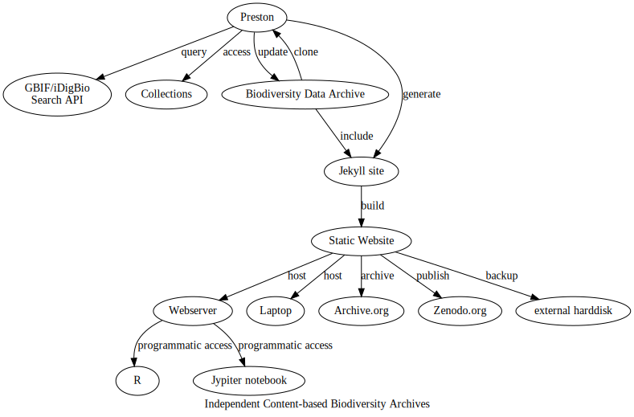




A biodiversity dataset graph: [{{ site.baseurl | prepend: site.url }}]({{ site.baseurl | prepend: site.url }}). {{ site.data.preston.created_at | date: "%Y" }}. [{{ site.data.preston.archive }}]({{ provenance }})

Biodiversity knowledge graph created using [Preston](https://preston.guoda.bio) v{{ site.data.preston.version }} and [Jekyll](https://jekyllrb.com) v{{ jekyll.version }} on {{ site.data.preston.created_at }}

## Welcome! 

Are you looking for a way to have fast, local access to GBIF/iDigBio indexed records and media?

Would you like to have an *exact* copy of the images in your research dataset? 

Do you want to include latest research data while keeping your original data around?

### Introducing Content-based Biodiversity Data Archives.

This automatically generated website contains a versioned archive of a custom selection of occurrence/specimen records and associated media. The selection is made using currently available biodiversity search indexes like the [iDigBio Search API](https://www.idigbio.org/wiki/index.php/IDigBio_API) or the [GBIF Occurrence Search API](https://www.gbif.org/developer/occurrence). The indexed data is archived using [Preston](https://github.com/bio-guoda/preston), a biodiversity data tracker that can version entire biodiversity dataset networks. Finally, the website is generated from the archived content using [Jekyll](https://jekyllrb.com/), the static site generator that powers GitHub pages. 

<a href="assets/preston.dot.svg"></a>

### Archive Indexed Content

This biodiversity data archive website was created with the following steps:

```
# first, create a new blank jekyll site (needs Jekyll v4+, tested on Jekyll v4.0.1)
jekyll new [site_dir] --blank 

cd [site_dir]

# use GBIF/iDigBio API to track specimen, occurrences and their related images.
preston track "{{ site.data.content | first | map: "url" }}" 

# generate Jekyll site for archived content
preston copyTo --type jekyll . 

# launch website and visit http://localhost:4000 in your browser
jekyll s 
``` 

### Clone data

You can clone an exact copy of the entire biodiversity data archive using:

```
# first, create a new blank jekyll site (needs Jekyll v4+, tested on Jekyll v4.0.1)
jekyll new [site_dir] --blank 

cd [site_dir]

# clone this existing biodiversity dataset graph 
preston clone "{{ "/data" | prepend: site.baseurl | prepend: site.url }}"

# generate Jekyll site for archived content
preston copyTo --type jekyll . 

# launch website and visit http://localhost:4000 in your browser
jekyll s 
``` 


### Programmatic access

#### Access to Indexed Records
Also, you can query the indexed data available through this site via the api at <a href="{{ endpoint }}">{{ endpoint }}</a> (one json object per line, [https://jsonlines.org/](https://jsonlines.org)) . 

With this, you can programmatically access the data and select the records you are interested in. 

For instance, using [curl](https://curl.se/) and [jq](https://stedolan.github.io/jq), you can show the first record by executing: 

```
$ curl "{{ endpoint }}" | jq -c 'select(.type == "records")' | head -n1 
{{ site.pages | where: "layout", "record" | first | map: "idigbio" | jsonify | strip_newlines }} 
```

Or, look for an occurrence with images indexed by GBIF:

```
$ curl "{{ endpoint }}" | jq -c 'select(.media[].type == "StillImage")' | head -n1 
{{ site.pages | where: "layout", "occurrence" | first | map: "gbif" | jsonify | strip_newlines }} 
```

Or, select archived iDigBio indexed records with scientific name matching _Liphanthus sabulosus_:

```
curl -s "{{ endpoint }}" | jq -c 'select(.data["dwc:scientificName"] == "Liphanthus sabulosus")' 
```

#### Access to Archive Content

This biodiversity archive contains local copies of remote content. 



You can access a list of all archived location via the content registry at [{{ registry }}]({{ registry }}) ((one json object per line, [https://jsonlines.org/](https://jsonlines.org))). Here's a way to get the first one:

```
$ curl -s "{{ registry }}" | head -n1
{{ site.data.content | first | jsonify | strip_newlines }}
```


#### More Access Methods

The backbone of this biodiversity data archive is their provenance log, or knowledge graph. This knowledge graph is stored in in [rdf](https://en.wikipedia.org/wiki/Resource_Description_Framework)/ nquad format and can loaded into triple store and queried using [SPARQL](https://en.wikipedia.org/wiki/SPARQL). 

Because the log is stored in a text file you can easily read it. For instance, the first 10 lines of the provenance graph (or knowledge graph) can be seen when running:

```
curl -s "{{ provenance | strip_newlines | prepend: "/" | prepend: site.baseurl | prepend: site.url }}" | head 
```  

For more information about how to fully take advantage of this biodiversity data graph, please review [preston documentation](https://preston.guoda.bio) for use cases, concepts and architecture.

### Updating

Many natural history collections are actively digitizing their collections. These collections are actively indexed by iDigBio as the new data records and media become available. This website can be updated to incorporate newly added or updated data by:

```
cd [site_dir]

# archive records and related images with criteria specified in some biodiversity search API
preston update "{{ site.data.content | first | map: "url" }}"

# update Jekyll site with archived content
preston copyTo --type jekyll .
```

### What is in this archive?

This archived dataset includes {{ site.pages | where: "layout", "record" | size }} iDigBio indexed specimen records, {{ site.pages | where: "layout", "mediarecord" | size }} iDigBio indexed media records, {{ site.pages | where: "layout", "occurrence" | size }} GBIF indexed occurrence records, and {{  site.pages | where: "layout", "occurrence" | map: "gbif" | map: "media" | compact | where: "type", "StillImage" | size }} GBIF indexed images.

The first 10-20 records and their associated media included in this data archive are:

<div style="display: flex; flex-direction: column; row-gap: 2em;">
  
  
  <div style="display: flex; flex-align: column; border: solid;">
    
  </div>
  
</div>

<div style="display: flex; flex-direction: column; row-gap: 2em;">
  
  
  <div style="display: flex; flex-align: column; border: solid;">
    
  </div>
  

</div>
