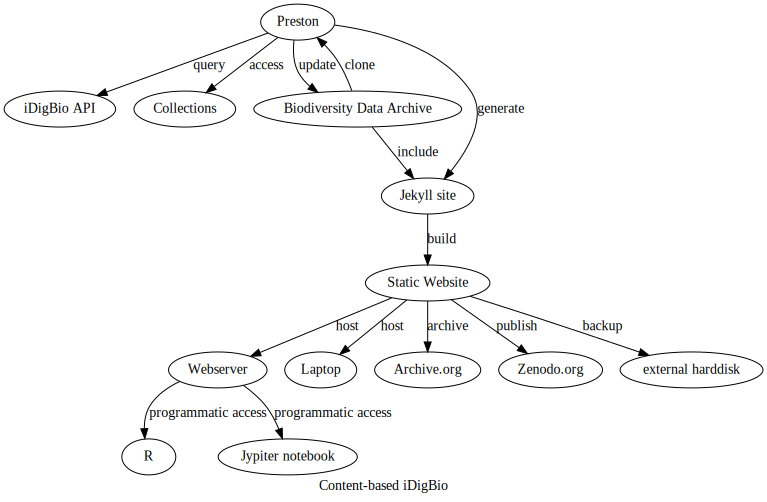



A biodiversity dataset graph: [{{ site.baseurl | prepend: site.url }}]({{ site.baseurl | prepend: site.url }}). {{ site.data.version.created_at | date: "%Y" }}. [{{ site.data.version.archive }}]()  

Created using [Preston](https://preston.guoda.bio) v{{ site.data.version.preston }} on {{ site.data.version.created_at }}.

## Welcome! 

Are you looking for a way to have fast, local access to iDigBio indexed records and media?

Would you like to have an *exact* copy of the images in your research dataset? 

Do you want to include latest research data while keeping your original data around?

Would you like to help preserve some (or all) of iDigBio's images and their associated specimen data?

### Introducing Content-based iDigBio.

This automatically generated website contains a versioned archive of a custom selection of specimen records and associated media. The selection is made using the [iDigBio Search API](https://www.idigbio.org/wiki/index.php/IDigBio_API), a powerful search engine powered by Elastic Search that contains over 130M vouchered specimen records. The data is archived using [Preston](https://github.com/bio-guoda/preston), a biodiversity data tracker that can version entire biodiversity dataset networks. Finally, the website is generated from the archived content using [Jekyll](https://jekyllrb.com/), the static site generator that powers GitHub pages. 

<a href="assets/preston.dot.svg"></a>

### Archive iDigBio-indexed content

This biodiversity data archive website was created with the following steps:

```
# first, create a new blank jekyll site (tested on Jekyll v4.0.1)
jekyll new [site_dir] --blank 

cd [site_dir]

# archive 10 iDigBio indexed Andrenidae records and related images
preston track "{{ site.data.content | first | map: "url" }}" 

# generate Jekyll site for archived content
preston copyTo --type jekyll . 

# launch website and visit http://localhost:4000 in your browser
jekyll s 
``` 

### Clone data

You can clone an exact copy of the entire biodiversity data archive using:

```
preston clone "{{ "/data" | prepend: site.baseurl | prepend: site.url }}"
```

### Programmatic access

Also, you can query the idigbio records available through this site via the api at <a href="{{ endpoint }}">{{ endpoint }}</a>. With this, you can programmatically access the data and select the records you are interested in. For instance, you can show the first record by executing: 

```
$ curl "{{ endpoint }}" | jq -c 'select(.type == "records")' | head -n1 
{{ site.pages | where: "layout", "record" | first | map: "idigbio" | jsonify | strip_newlines }} 

```

Or, use [jq](https://stedolan.github.io/jq) to select the records with scientific name matching _Liphanthus sabulosus_:

```
curl -s "{{ endpoint }}" | jq -c 'select(.data["dwc:scientificName"] == "Liphanthus sabulosus")' 
```

### Updating

Many natural history collections are actively digitizing their collections. These collections are actively indexed by iDigBio as the new data records and media become available. This website can be updated to incorporate newly added or updated data by:

```
cd [site_dir]

# archive records and related images with criteria specified in the iDigBio search API
preston update "{{ site.data.content | first | map: "url" }}"

# update Jekyll site with archived content
preston copyTo --type jekyll .
```

### What is in this archive?

This archived dataset includes {{ site.pages | where: "layout", "record" | size }} specimen records and {{ site.pages | where: "layout", "mediarecord" | size }} media records. 

The first 10 records and their associated media included in this data archive are:

<div style="display: flex; flex-direction: column; row-gap: 2em;">
  
  
  
  <div style="display: flex; flex-align: column; border: solid;">
    
  </div>
  

</div>
